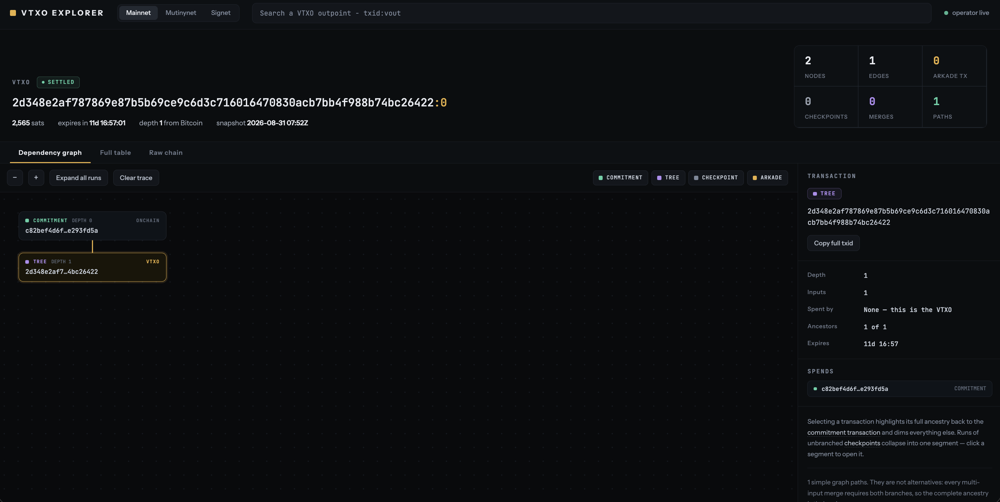

# VTXO Explorer

Explorer for Arkade VTXOs — paste an outpoint, see its full transaction DAG back to the onchain
commitment tx.



Arkade transactions live offchain until they settle, so a VTXO is the tip of a chain of ark, tree
and checkpoint transactions rooted in a single onchain commitment. This resolves that chain and
draws it three ways:

- **Dependency graph** — the DAG, with runs of unbranched checkpoints collapsed into segments you
  can expand. Selecting a transaction highlights its full ancestry and dims everything else.
- **Full table** — every transaction in the chain, sortable and scannable.
- **Raw chain** — the indexer response, unedited.

It's a static site with no backend: the browser talks to the Arkade operator directly.

## Quickstart

```sh
pnpm install
pnpm dev
```

Open the dev server URL and paste a `txid:vout` outpoint, or click one of the landing-page
examples. A bare txid works too — it probes the first few outputs and asks which you meant.

## Scripts

| Command | What it does |
|---|---|
| `pnpm dev` | Dev server |
| `pnpm build` | Production build, and the real typecheck gate |
| `pnpm preview` | Serve the production build |
| `pnpm lint` | oxlint |
| `pnpm test` | Vitest (`VITE_LIVE=1` also runs a live smoke test) |

> Note: `tsc --noEmit` is a no-op in this repo — the root tsconfig uses project references, so it
> checks nothing and exits 0. Gate on `pnpm build`.

## Networks

Mutinynet (default), Signet, and Mainnet. The last-used network is remembered; `?net=` in the URL
always wins.

## Sharing a view

URLs carry the subject in the path and the view in the query, so a link restores what you were
looking at:

```
/vtxo/{txid}/{vout}?net=mainnet&tab=graph&sel={txid}
```

Network and the selected transaction survive a share; zoom and expanded segments don't.

## Layout

`src/graph/` is the pure, framework-free graph core — build, layout, ancestry, path counting —
and is unit-tested against a captured 99-node chain. `src/lib/` holds the indexer client and
query parsing, `src/components/` the views, and `src/styles/tokens.css` the design tokens.

`PLAN.md` has the details: locked decisions, live-probed API facts, the graph-core spec, and the
sharp edges worth knowing before you touch the data layer.

## License

MIT
